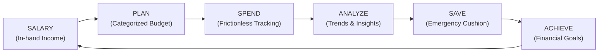
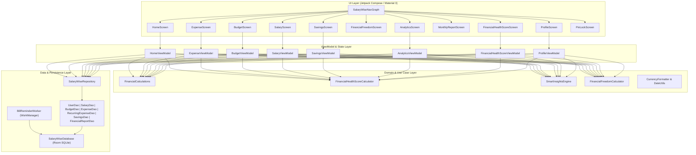
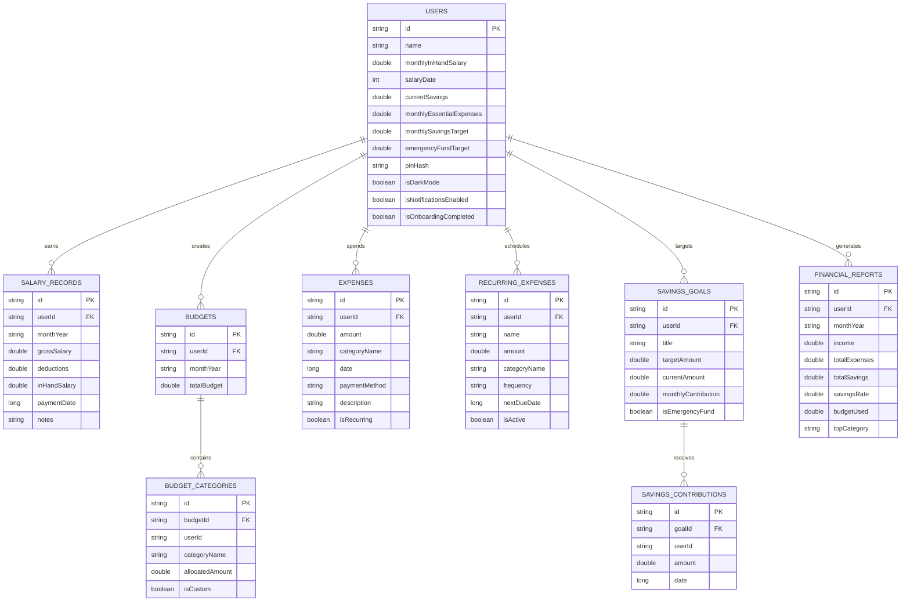

# SalaryWise - Complete Project Documentation

**Project Name**: SalaryWise  
**Target Platform**: Android Mobile Application (API 26+) & Interactive Web Simulator  
**Default Currency**: INR (₹)  
**Date Format**: DD/MM/YYYY  
**GitHub Repository**: [https://github.com/Akash-Saini47/Employee-Free](https://github.com/Akash-Saini47/Employee-Free)  
**Main Branch**: `main`

---

## 1. Executive Summary & Core Product Loop

**SalaryWise** is an intentional, employee-first financial management system. Unlike traditional, passive expense loggers, SalaryWise enforces a structured financial discipline loop:



### Key Principles
1. **Factual & Honest**: Insights, health scores, and metrics are derived strictly from stored data without inventing figures or offering misleading financial advice.
2. **No False Promises**: The app never guarantees financial freedom or investment returns. Instead, it provides objective stability indicators (e.g., months of emergency runway).
3. **Local-First & Private**: Financial data is stored securely on the user's device using an Room SQLite database in Android app-private storage and optional 4-digit PIN lock.

---

## 2. System Architecture

SalaryWise is implemented across two comprehensive deliverables:
1. **`android-app/`**: A native Android Studio project written in **Kotlin 2.0+**, utilizing **Jetpack Compose**, **Material 3**, **Room Relational Database**, **Coroutines / StateFlow**, and **AndroidX WorkManager**.
2. **`web-preview/`**: A companion interactive mobile simulator running on HTML5/CSS3/ES6 and Chart.js, served locally via Python HTTP server (`serve.py`), allowing instant testing of all 21 sections.



---

## 3. Detailed Implementation of All 21 Sections

### Section 1: Onboarding (`OnboardingScreen.kt`)
- **Inputs**: Name, Monthly In-Hand Salary, Salary Credit Date (1–31), Current Liquid Savings, Monthly Essential Expenses, Monthly Savings Target, Emergency Fund Target.
- **Flexibility**: Optional fields can be skipped with sensible defaults.
- **Automated First Financial Plan**: Upon form submission, the repository initializes:
  1. An initial salary record for the current month.
  2. 14 default budget categories allocated based on income and essential expenses.
  3. A baseline Emergency Fund goal targeting 6 months of essential living costs.

### Section 2: Home Dashboard (`HomeScreen.kt`)
Presents a clean, high-contrast Material 3 dashboard:
- **Hero Card**:
  - Monthly Salary: **₹40,000**
  - Total Expenses: **₹24,500**
  - Total Saved: **₹15,500**
  - Remaining Money: **₹15,500**
  - Savings Rate: **38.75%**
  - Budget Used: **61.2%**
- **Overspending & Threshold Alerts**: Color-coded banners for budget thresholds ($\ge 80\%$ warning in amber, $> 100\%$ exceeded in rose, and income deficit alerts).
- **Smart Insight Card**: Factual insight highlighting progress or spending spikes.
- **Upcoming Recurring Bills**: Lists bills due within 14 days with an inline **Pay** action.
- **Emergency Fund Widget**: Displays progress bar and exact months of essential living costs covered.
- **Prominent "+ Add Expense" Floating Action Button**.

### Section 3: Salary Management (`SalaryScreen.kt`)
- Full CRUD operations: Add, Edit, and Delete salary entries.
- Fields: Month/Year (`yyyy-MM`), Gross Salary, Deductions (EPF, Tax, Insurance), In-Hand Salary, Payment Date, Notes.
- Automatic in-hand calculation:
  $$\text{In-Hand Salary} = \text{Gross Salary} - \text{Deductions}$$
- Historical records tracking income growth over time (e.g., April: ₹35,000 → May: ₹35,000 → June: ₹38,000 → July: ₹40,000).
- Visual comparative bar chart illustrating salary progression.

### Section 4: Monthly Budget (`BudgetScreen.kt`)
- Pre-populated with 14 default categories: *Rent, Food, Groceries, Transportation, Utilities, Bills, Shopping, Entertainment, Healthcare, Education, EMI, Investments, Savings, Other*.
- Support for custom user-created categories.
- For every category, shows: **Budget Allocated**, **Actual Spent**, **Remaining**, and **Percentage Used**.
- Guardrails:
  - $\ge 80\%$: Warning tag.
  - $> 100\%$: Red alert: *"You have exceeded your budget for this category."*

### Section 5: Expense Management (`ExpenseScreen.kt`)
- Optimized for fast, multi-time daily logging via bottom sheet.
- Fields: Amount (₹), Category, Date (`DD/MM/YYYY`), Payment Method (*Cash, UPI, Debit Card, Credit Card, Bank Transfer, Other*), Description/Merchant Note, Recurring flag.
- Real-time search by description or category.
- Filter chips: *Today, This Week, This Month, All Time*.
- Dropdown filters for Category and Payment Method.
- Ascending/Descending sort by Amount and Date.
- Safe delete confirmation dialogs.

### Section 6: Recurring Expenses (`RecurringExpenseScreen.kt`)
- Schedules fixed commitments: *Rent, EMI, Netflix, Broadband, Mobile, Insurance, Electricity*.
- Fields: Name, Amount, Category, Frequency (*Monthly, Weekly, Quarterly, Yearly*), Next Due Date.
- Upcoming recurring expenses surfaced on the Home screen.
- **"Pay Now" Action**: Logs an actual expense record in the current month and advances the due date to the next cycle.

### Section 7: Savings & Goals (`SavingsScreen.kt`)
- Displays: Current Total Savings, Monthly Savings, Savings Rate, Monthly Savings Target, Overall Goal Progress %.
- Multi-goal tracking: *Emergency Fund, New Laptop, Vacation, Car, Education, House, Custom Goal*.
- Each goal displays Target Amount, Current Amount, Remaining Amount, Monthly Contribution, Progress %, and Estimated Months to Completion.
- Direct **"+ Add Money" Deposit Modal** with transaction logging.

### Section 8: Financial Freedom & Stability (`FinancialFreedomScreen.kt`)
- Strictly avoids misleading promises of guaranteed wealth.
- Indicators:
  - Emergency Fund Total
  - Essential Monthly Expenses
  - **Emergency Coverage**:
    $$\text{Months Covered} = \frac{\text{Emergency Fund}}{\text{Essential Monthly Expenses}}$$
  - Savings Rate %
  - Debt-to-Income (DTI) Ratio %
- Milestone stages:
  - **1 Month**: Starter Buffer
  - **3 Months**: Essential Security
  - **6 Months**: Financial Stability
  - **12 Months**: High Resilience
- Dynamic explanation: *"Your emergency fund currently covers approximately X months of essential expenses."*

### Section 9: Analytics (`AnalyticsScreen.kt`)
- 7 visual charts:
  1. Income vs Expenses vs Saved
  2. Category-Wise Expenses (Donut / Pie breakdown)
  3. Budget vs Actual Spending (Grouped bars)
  4. Monthly Spending & Savings Trend (Line chart)
  5. Salary Growth Over Time
  6. Savings Rate Trend
  7. Discretionary vs Essential Breakdown
- Filters: *This Month, Last Month, Last 3 Months, Last 6 Months, This Year*.
- Statistical metrics: Average Monthly Expense, Average Monthly Savings, Highest Single Expense, Top Spending Category, and Budget Utilization.

### Section 10: Smart Insights (`SmartInsightsEngine.kt`)
- Factual and derived strictly from database records:
  - *"Your food spending increased by 18% compared with last month."*
  - *"You have used 84% of your shopping budget."*
  - *"Your savings increased from ₹10,000 to ₹14,000."*
  - *"Entertainment is your highest discretionary expense this month."*
  - *"Your expenses are higher than your income this month."*

### Section 11: Monthly Financial Report (`MonthlyReportScreen.kt`)
- End-of-month summary document:
  - Total Income, Total Expenses, Total Savings, Savings Rate, Budget Utilization
  - Top Spending Category & Largest Single Expense
  - Month-over-Month Comparison:
    $$\text{Expenses } \downarrow 8\% \quad|\quad \text{Savings } \uparrow 12\%$$
  - Goal and Emergency Fund Progress Summary
  - Export / Share snapshot capability

### Section 12: Financial Health Score (`FinancialHealthScoreScreen.kt`)
- Transparent 0–100 score calculated across 5 objective factors:
  - Savings Rate (up to 30 pts)
  - Budget Adherence (up to 25 pts)
  - Emergency Fund Progress (up to 25 pts)
  - Expense Consistency (up to 10 pts)
  - Discretionary Spike Control (up to 10 pts)
- Itemized factor breakdown:
  - `+ Good savings rate`
  - `+ Budget mostly maintained`
  - `+ Emergency fund growing`
  - `- Shopping expenditure increased`
- Non-advisory disclaimer stating the score is an automated behavioral indicator.

### Section 13: Notifications & Background Worker (`BillReminderWorker.kt`)
- Android WorkManager `PeriodicWorkRequest` running once every 24 hours.
- Alerts for: Salary received, Upcoming bills, Budget threshold warnings (80% and 100%), and Monthly reports.
- Notification Center view to browse past notifications and dismiss alerts.

### Section 14: Android Navigation (`SalaryWiseNavGraph.kt`, `BottomNavBar.kt`)
- Standard Android Material 3 Bottom Navigation:
  - **Home**
  - **Expenses**
  - **Budget**
  - **Analytics**
  - **Goals**
- Top App Bar with Notification Bell and Profile/Settings avatar.
- Prominent Floating Action Button for adding expenses.

### Section 15: Profile & Settings (`ProfileScreen.kt`, `SettingsScreen.kt`)
- User Profile management (Name, Salary, Salary Date).
- Currency: **INR (₹)**.
- Date Format: **DD/MM/YYYY**.
- Light & Dark mode switch.
- Notification toggles.
- Security PIN configuration.
- **Export Data**: Full database export as serialized JSON backup.
- **Delete All Financial Data**: Safe wipe with confirmation dialog.
- **Delete Account & Reset**: Return to onboarding.

### Section 16: Relational Database Architecture (`SalaryWiseDatabase.kt`)
Built with Room SQLite using 9 relational entities:
- `UserEntity.kt`
- `SalaryRecordEntity.kt`
- `BudgetEntity.kt`
- `BudgetCategoryEntity.kt`
- `ExpenseEntity.kt`
- `RecurringExpenseEntity.kt`
- `SavingsGoalEntity.kt`
- `SavingsContributionEntity.kt`
- `FinancialReportEntity.kt`

### Section 17: Calculations Reference
- **Remaining Money**: $\text{Income} - \text{Total Expenses}$
- **Savings**: $\text{Income} - \text{Total Expenses}$
- **Savings Rate**: $(\text{Savings} / \text{Income}) \times 100$
- **Budget Remaining**: $\text{Budget} - \text{Actual Expenses}$
- **Budget Utilization**: $(\text{Actual Expenses} / \text{Budget}) \times 100$
- **Emergency Fund Coverage**: $\text{Emergency Fund} / \text{Essential Monthly Expenses}$
- **Goal Progress**: $(\text{Current Amount} / \text{Target Amount}) \times 100$

### Section 18: Smart Budget Behavior
- Visual warning when category spending $\ge 80\%$.
- Alert when category spending $> 100\%$.
- Alert when monthly expenses exceed income.
- Positive feedback upon savings rate improvement.
- Analytics highlights for category spending spikes.

### Section 19: UI Design & UX
- Material Design 3 clean cards, rounded components (14–24dp), and clear hierarchy.
- Large financial typography for figures (e.g., `₹40,000`, `38.75%`).
- Empty states, loading states, error handling, and confirmation dialogs for delete operations.
- Contrast-tested Light & Dark mode themes.

### Section 20: Privacy & Security
- Local-first architecture: financial data remains strictly on the user's device.
- 4-digit PIN lock screen with numeric keypad.
- JSON backup export capability; import/restore is intentionally not implemented yet.
- Explicit confirmation dialogs before deleting records or resetting accounts.

### Section 21: Product Principle
The app guides the user through the discipline loop: **TRACK → ANALYZE → PLAN → CONTROL → SAVE → ACHIEVE GOALS** without false guarantees, fostering sustainable financial habits.

---

## 4. Relational Database Schema Diagram



---

## 5. Project Directory & File Inventory

```
Employee_Free/
├── .gitignore                                      # Ignore build files, .gradle, IDE caches
├── README.md                                       # Main repository overview & quickstart
├── PROJECT_DOCUMENTATION.md                        # Complete engineering documentation
├── serve.py                                        # Local Python HTTP server on port 8080
│
├── android-app/                                    # Native Android Project
│   ├── build.gradle.kts                            # Root buildscript
│   ├── settings.gradle.kts                         # Root settings
│   ├── gradle.properties                           # JVM & AndroidX settings
│   ├── gradlew                                     # Linux/macOS Gradle wrapper
│   ├── gradlew.bat                                 # Windows Gradle wrapper
│   ├── gradle/
│   │   ├── libs.versions.toml                      # Version catalog
│   │   └── wrapper/gradle-wrapper.properties       # Gradle 8.9 distribution config
│   └── app/
│       ├── build.gradle.kts                        # Module build configuration & dependencies
│       ├── proguard-rules.pro                      # ProGuard rules for Room & Compose
│       └── src/main/
│           ├── AndroidManifest.xml                 # App permissions, activities, metadata
│           ├── res/
│           │   ├── values/strings.xml              # Localized strings, currency symbols
│           │   ├── values/colors.xml               # Material 3 color definitions
│           │   ├── values/themes.xml               # Light theme definition
│           │   ├── values-night/themes.xml         # Dark theme definition
│           │   ├── xml/backup_rules.xml            # Data backup rules
│           │   ├── xml/data_extraction_rules.xml   # Android 12+ cloud extraction rules
│           │   └── drawable/                       # Vector launcher icons & assets
│           └── java/com/salarywise/app/
│               ├── MainActivity.kt                 # Compose entry point
│               ├── SalaryWiseApplication.kt        # App lifecycle & WorkManager initialization
│               ├── data/
│               │   ├── local/
│               │   │   ├── SalaryWiseDatabase.kt   # Room database with 9 entities
│               │   │   ├── entity/                 # Room database entities
│               │   │   │   ├── UserEntity.kt
│               │   │   │   ├── SalaryRecordEntity.kt
│               │   │   │   ├── BudgetEntity.kt
│               │   │   │   ├── BudgetCategoryEntity.kt
│               │   │   │   ├── ExpenseEntity.kt
│               │   │   │   ├── RecurringExpenseEntity.kt
│               │   │   │   ├── SavingsGoalEntity.kt
│               │   │   │   ├── SavingsContributionEntity.kt
│               │   │   │   └── FinancialReportEntity.kt
│               │   │   └── dao/                    # Room DAOs with reactive Flows & queries
│               │   │       ├── UserDao.kt
│               │   │       ├── SalaryDao.kt
│               │   │       ├── BudgetDao.kt
│               │   │       ├── ExpenseDao.kt
│               │   │       ├── RecurringExpenseDao.kt
│               │   │       ├── SavingsDao.kt
│               │   │       └── FinancialReportDao.kt
│               │   └── repository/
│               │       └── SalaryWiseRepository.kt # Central repository with full CRUD & JSON export
│               ├── domain/
│               │   └── model/
│               │       ├── CurrencyFormatter.kt    # INR Indian numbering format (₹40,000)
│               │       ├── DateUtils.kt            # DD/MM/YYYY formatting & date range logic
│               │       ├── PaymentMethod.kt        # Cash, UPI, Cards, Bank Transfer enums
│               │       ├── FinancialCalculations.kt# Core mathematical metrics & budget guardrails
│               │       ├── FinancialHealthScore.kt # 0-100 algorithmic score engine & factors
│               │       ├── FinancialInsight.kt     # Data-driven factual insight generator
│               │       └── FinancialFreedomMetrics.kt# Stability milestones & runway calculator
│               ├── ui/
│               │   ├── theme/
│               │   │   ├── Color.kt                # Material 3 emerald/teal theme colors
│               │   │   ├── Type.kt                 # Plus Jakarta Sans / Roboto typography
│               │   └── Theme.kt                    # SalaryWise dynamic theme wrapper
│               ├── navigation/
│               │   ├── Screen.kt                   # Sealed class routes
│               │   ├── BottomNavBar.kt             # Material 3 BottomNavigationBar
│               │   └── SalaryWiseNavGraph.kt       # NavHost wiring all 12 screens & PIN lock
│               ├── components/
│               │   ├── StatCards.kt                # Hero financial summary cards
│               │   ├── FinancialProgressBar.kt     # Color-coded threshold progress bars
│               │   ├── AddExpenseBottomSheet.kt    # Rapid modal expense entry sheet
│               │   └── ConfirmDeleteDialog.kt      # Delete confirmation dialogs
│               └── screens/
│                   ├── onboarding/OnboardingScreen.kt
│                   ├── home/HomeScreen.kt & HomeViewModel.kt
│                   ├── salary/SalaryScreen.kt & SalaryViewModel.kt
│                   ├── budget/BudgetScreen.kt & BudgetViewModel.kt
│                   ├── expense/ExpenseScreen.kt & ExpenseViewModel.kt
│                   ├── recurring/RecurringExpenseScreen.kt
│                   ├── savings/SavingsScreen.kt & SavingsViewModel.kt
│                   ├── financialfreedom/FinancialFreedomScreen.kt
│                   ├── analytics/AnalyticsScreen.kt & AnalyticsViewModel.kt
│                   ├── report/MonthlyReportScreen.kt
│                   ├── healthscore/FinancialHealthScoreScreen.kt
│                   ├── notifications/NotificationCenterScreen.kt
│                   ├── profile/ProfileScreen.kt
│                   └── security/PinLockScreen.kt
│               └── worker/
│                   └── BillReminderWorker.kt       # Background daily bill reminder worker
│
└── web-preview/                                    # Interactive Mobile Android Simulator
    ├── index.html                                  # Mobile layout & phone bezel frame
    ├── styles.css                                  # Android Material 3 CSS & light/dark theme
    └── app.js                                      # App logic, state, calculations & Chart.js
```

---

## 6. How to Run & Verify

### A. Live Interactive Simulator
The web simulator is served locally via `serve.py`:
```powershell
python serve.py
```
- Open **[http://localhost:8080](http://localhost:8080)** in Chrome, Edge, or a mobile browser.
- Test features:
  - Toggle between **Light Mode** and **Dark Mode**.
  - Toggle **Phone Frame ON/OFF**.
  - Add expenses and observe real-time budget warnings and hero card recalculations.
  - Test the **PIN Security Lock** screen.
  - Review the **Monthly Financial Report** and **Financial Health Score**.
  - Click **Export Data (JSON)** to test backup serialization.

### B. Native Android Studio Project
1. Open Android Studio.
2. Select **File → Open...** and point to `android-app/`.
3. Allow Gradle to synchronize dependencies.
4. Run on an Android emulator or device running API 26+.

---

## 7. Version Control & GitHub

The complete codebase has been committed and pushed:
- **Repository**: `https://github.com/Akash-Saini47/Employee-Free.git`
- **Branch**: `main`
- **Status**: Clean working tree, fully synced with `origin/main`.
