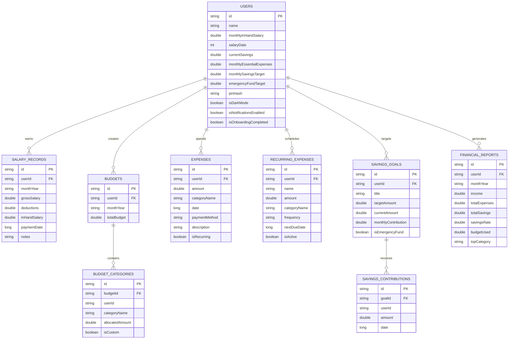

# SalaryWise - Android Mobile Application

> **Smart Salary & Financial Management for Employees**  
> *"Track → Analyze → Plan → Control → Save → Achieve Financial Goals"*

SalaryWise is a personal finance and salary management application built specifically for salaried employees. Rather than acting as a simple passive expense logger, SalaryWise guides employees through a continuous financial discipline loop: understanding net take-home salary, building an intentional monthly budget, managing recurring bills, keeping debt under control, establishing an emergency cushion, and tracking goal-oriented savings.

---

## 📱 Platforms & Deliverables

This repository contains two complete deliverables:

1. **`android-app/`** - **Production-grade Native Android Project**:
   - Modern Android Architecture (Data → Repository → Domain → ViewModel → UI)
   - **Kotlin 2.0+** & **Jetpack Compose** with **Material Design 3**
   - **Room Relational Database (SQLite)** with 9 relational entities, DAOs, and transactions
   - **Kotlin Coroutines & Reactive StateFlow**
   - **AndroidX WorkManager** for background bill reminders and budget threshold alerts
   - **Light & Dark mode** with custom theme system
   - **Biometric & PIN lock** security protection
   - Native Gradle 8.9 wrapper (`gradlew` & `gradlew.bat`) ready to open in Android Studio.

2. **`web-preview/`** & **`serve.py`** - **Interactive Android Phone Simulator & Live Preview**:
   - Runs in any modern web browser or mobile browser via standard Python HTTP server.
   - Features a Google Pixel mobile frame with status bar, dynamic clock, and bottom navigation.
   - Includes real-time calculation engines matching Section 17 formulas.
   - Interactive Chart.js analytics, instant Quick-Add Expense sheets, custom category creators, deposit trackers, and data export/import.

---

## 🚀 Quick Start: Live Interactive Preview

To run the interactive mobile simulator right now:

```powershell
python serve.py
```

Then open your browser at:
👉 **[http://localhost:8080](http://localhost:8080)**

Alternatively, open `c:\Users\Asus\Desktop\Employee_Free\web-preview\index.html` directly in Google Chrome or Microsoft Edge.

---

## 🛠️ Native Android Studio Project Setup

1. Open **Android Studio** (Hedgehog / Iguana / Jellyfish / Ladybug or newer).
2. Select **File → Open...** and select the folder `c:\Users\Asus\Desktop\Employee_Free\android-app`.
3. Allow Gradle to sync dependencies from Google Maven & Maven Central.
4. Select an Android Virtual Device (AVD) running **Android 8.0 (API 26) or higher** (Android 14/15 recommended).
5. Click **Run** (`Shift + F10`) to build and launch `com.salarywise.app` on the emulator or physical device.

---

## 📋 Comprehensive Feature Implementation Guide

### 1. Onboarding (`OnboardingScreen.kt`)
- Collects:
  - Full Name
  - Monthly In-Hand Net Salary
  - Salary Credit Day (1 to 31)
  - Current Liquid Savings
  - Monthly Essential Expenses
  - Monthly Savings Target
  - Emergency Fund Target (defaults to 6 months of essentials)
- Supports skipping optional fields.
- **Automatic First Financial Plan**: Upon submission, SalaryWise automatically generates the initial monthly salary record, configures 14 default budget category allocations, and creates the baseline Emergency Fund savings goal.

### 2. Home Dashboard (`HomeScreen.kt`)
- Real-time **Hero Financial Card**:
  - Monthly Salary: **₹40,000**
  - Total Expenses: **₹24,500**
  - Total Saved: **₹15,500**
  - Remaining Money: **₹15,500**
  - Savings Rate: **38.75%**
  - Budget Used: **61.2%**
- **Overspending & Budget Warnings Banner**: Dynamically warns when a category reaches ≥ 80% and alerts when > 100%. Displays a warning if monthly expenses exceed income.
- **Smart Insight Card**: Factual, data-backed observation (e.g. *"Your savings rate increased by 5% compared with last month"*).
- **Upcoming Recurring Bills**: Lists bills due within 14 days with an instant *"Pay"* action.
- **Emergency Fund Progress Bar**: Shows current coverage in months (e.g., *"Covers approximately 4.0 months of essential expenses"*).
- **Quick Action Bar**: Fast shortcuts to Salary, Bills, Stability, and Monthly Report.
- **Floating Action Button**: Prominent `+ Add Expense` button.

### 3. Salary Management (`SalaryScreen.kt`)
- Full salary lifecycle: Add, Edit, and Delete salary entries.
- Fields: Month/Year (`yyyy-MM`), Gross Salary, Deductions (EPF, Professional Tax, TDS, Health Insurance), In-hand Salary, Payment Date, and Notes.
- Automatic In-hand calculation:
  $$\text{In-Hand Salary} = \text{Gross Salary} - \text{Deductions}$$
- Supports distinct salary records for different months:
  - *April: ₹35,000*
  - *May: ₹35,000*
  - *June: ₹38,000*
  - *July: ₹40,000*
- **Salary Growth Chart**: Visual comparison bars tracking income trajectory over time.

### 4. Monthly Budget (`BudgetScreen.kt`)
- 14 default categories:
  - *Rent, Food, Groceries, Transportation, Utilities, Bills, Shopping, Entertainment, Healthcare, Education, EMI, Investments, Savings, Other*.
- Support for custom categories (e.g. *Pet Care, Gaming, Hobbies*).
- For every category, displays:
  - Budget Allocated
  - Actual Spending
  - Remaining Balance
  - Percentage Used
- **Smart Budget Guardrails**:
  - Yellow warning tag when category spending $\ge 80\%$.
  - Red alert tag when category spending $> 100\%$: *"You have exceeded your budget for this category."*

### 5. Expense Management (`ExpenseScreen.kt`)
- Super-fast expense logging bottom sheet modal.
- Fields:
  - Amount (₹)
  - Category
  - Date formatted strictly as `DD/MM/YYYY`
  - Payment Method: **Cash, UPI, Debit Card, Credit Card, Bank Transfer, Other**
  - Description / Merchant Note
  - Recurring Expense checkbox
- Instant search filter by description or category.
- Filter chips: **Today, This Week, This Month, All Time**.
- Dropdown filters for Category and Payment Method.
- Ascending/Descending sort by amount or date.
- Delete confirmation dialog.

### 6. Recurring Expenses (`RecurringExpenseScreen.kt`)
- Tracks fixed commitments: *Rent, EMI, Netflix/Subscriptions, Internet Broadband, Mobile Recharge, Insurance, Electricity, Utility Bills*.
- Fields: Expense Name, Amount, Category, Frequency (*Monthly, Weekly, Quarterly, Yearly*), and Next Due Date.
- Shows upcoming bills directly on the Home Dashboard.
- **"Pay Now" One-Tap Logging**: Records an actual transaction into the current month's expenses and automatically advances the recurring due date to the next cycle.

### 7. Savings & Goals (`SavingsScreen.kt`)
- Dedicated savings center displaying:
  - Current Total Savings
  - Monthly Savings
  - Savings Rate
  - Monthly Savings Target
  - Overall Target Progress
- Multiple customizable goals:
  - *Emergency Fund, New Laptop, Vacation, Car, Education, House, Custom Goal*.
- Each goal displays:
  - Target Amount (₹)
  - Current Amount (₹)
  - Remaining Amount (₹)
  - Monthly Contribution (₹)
  - Progress % with color-coded progress bar
  - Estimated Months to Completion
- Direct **"+ Add Money" Deposit Modal** with transaction notes.

### 8. Financial Freedom & Stability (`FinancialFreedomScreen.kt`)
- Objective financial resilience metrics (strictly avoids false promises of guaranteed wealth):
  - Emergency Fund Total
  - Essential Monthly Expenses
  - **Months of Expenses Covered**:
    $$\text{Months Covered} = \frac{\text{Emergency Fund}}{\text{Essential Monthly Expenses}}$$
  - Savings Rate %
  - Debt-to-Income (DTI) Ratio %
- Visual milestone indicator:
  - **1 Month**: Starter Buffer
  - **3 Months**: Essential Security
  - **6 Months**: Financial Stability
  - **12 Months**: High Resilience
- Dynamic explanation: *"Your emergency fund currently covers approximately X months of essential expenses."*
- Actionable next steps based on user's current stage.

### 9. Analytics (`AnalyticsScreen.kt`)
- Interactive charts:
  1. **Income vs Expenses vs Saved** (Comparison column chart)
  2. **Monthly Savings & Rate Trend**
  3. **Category-Wise Expenses** (Donut chart with percentage breakdown)
  4. **Budget vs Actual Spending** (Grouped side-by-side bars)
  5. **Monthly Spending Trend** (Multi-month line chart)
  6. **Salary Growth Trend**
- Time filters: **This Month, Last Month, Last 3 Months, Last 6 Months, This Year**.
- Statistical metrics:
  - Average Monthly Expense
  - Average Monthly Savings
  - Highest Single Expense
  - Highest Spending Category
  - Lowest Spending Category
  - Budget Utilization Rate

### 10. Smart Insights (`SmartInsightsEngine.kt`)
- Factual insights engine derived purely from stored database records:
  - *"Your food spending increased by 18% compared with last month."*
  - *"You have used 84% of your shopping budget."*
  - *"Your savings increased from ₹10,000 to ₹14,000."*
  - *"Entertainment is your highest discretionary expense this month."*
  - *"Your expenses are higher than your income this month."*

### 11. Monthly Financial Report (`MonthlyReportScreen.kt`)
- End-of-month summary document:
  - Total Income, Total Expenses, Total Savings, Savings Rate, Budget Utilization
  - Top Spending Category & Largest Expense Transaction
  - Month-over-Month Comparison:
    $$\text{Expenses } \downarrow 8\% \quad|\quad \text{Savings } \uparrow 12\%$$
  - Goal & Safety Net updates
  - Export / Share snapshot capability

### 12. Financial Health Score (`FinancialHealthScoreScreen.kt`)
- Transparent 0–100 score calculated using 5 objective factors:
  1. Savings Rate (up to 30 pts)
  2. Budget Adherence (up to 25 pts)
  3. Emergency Fund Coverage (up to 25 pts)
  4. Income vs Expenses Consistency (up to 10 pts)
  5. Goal & Discretionary Control (up to 10 pts)
- Clear itemized breakdown:
  - `+ Good savings rate`
  - `+ Budget mostly maintained`
  - `+ Emergency fund growing`
  - `- Shopping expenditure increased`
- Non-advisory disclaimer stating the score is an automated behavioral indicator.

### 13. Notifications & Worker (`NotificationCenterScreen.kt`, `BillReminderWorker.kt`)
- Background `PeriodicWorkRequest` running via Android WorkManager to verify due dates every 24 hours.
- Alerts for: Salary received, Upcoming bills, Budget threshold warnings, Savings reminders, and Monthly reports.
- Notification Center view to browse past notifications and alerts.

### 14. Android Navigation (`SalaryWiseNavGraph.kt`, `BottomNavBar.kt`)
- Bottom navigation with 5 primary tabs:
  - **Home**
  - **Expenses**
  - **Budget**
  - **Analytics**
  - **Goals**
- Top-right Profile avatar button accessing Profile & Settings.
- Bell icon navigating to Notification Center.

### 15. Profile & Settings (`ProfileScreen.kt`, `SettingsScreen.kt`)
- User Profile management (Name, Salary, Salary Date).
- Currency: **INR (₹)**.
- Date Format: **DD/MM/YYYY**.
- Dark Mode / Light Mode instant toggle.
- Notification preferences.
- Security PIN Setup & App Lock.
- **Export Data**: Full database export as serialized JSON backup.
- **Delete All Financial Data**: Safe wipe with confirmation dialog.
- **Delete Account & Reset**: Total reset returning to initial onboarding.

---

## 🗄️ Relational Database Schema (`SalaryWiseDatabase.kt`)



---

## 📐 Formulas & Calculations Reference

| Metric | Mathematical Formula | Purpose |
| :--- | :--- | :--- |
| **Remaining Money** | $\text{Income} - \text{Total Expenses}$ | Cash flow cushion remaining for the month |
| **Monthly Savings** | $\text{Income} - \text{Total Expenses}$ | Actual surplus added to liquid savings |
| **Savings Rate (%)** | $\left(\frac{\text{Savings}}{\text{Income}}\right) \times 100$ | Financial efficiency benchmark (Target: $\ge 30\%$) |
| **Budget Remaining** | $\text{Budget} - \text{Actual Expenses}$ | Spend allowance remaining before month end |
| **Budget Utilization (%)** | $\left(\frac{\text{Actual Expenses}}{\text{Budget}}\right) \times 100$ | Spending discipline (Warning $\ge 80\%$, Exceeded $> 100\%$) |
| **Emergency Coverage** | $\frac{\text{Emergency Fund}}{\text{Essential Expenses}}$ | Months of survival runway in crisis |
| **Goal Progress (%)** | $\left(\frac{\text{Current Amount}}{\text{Target Amount}}\right) \times 100$ | Velocity towards target milestones |

---

## 🔒 Security & Privacy (Section 20)

- **Local Storage First**: All records stay on the employee's personal device inside Room SQLite / local encrypted database.
- **PIN Lock Screen**: Optional 4-digit numeric PIN protection blocking unauthorized access upon opening the app.
- **Data Export & Portability**: Instant one-click JSON backup generation.
- **Complete Erasure**: Full compliance with data deletion standards via double-confirmation reset dialogs.
